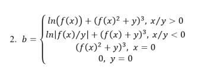
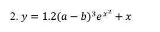
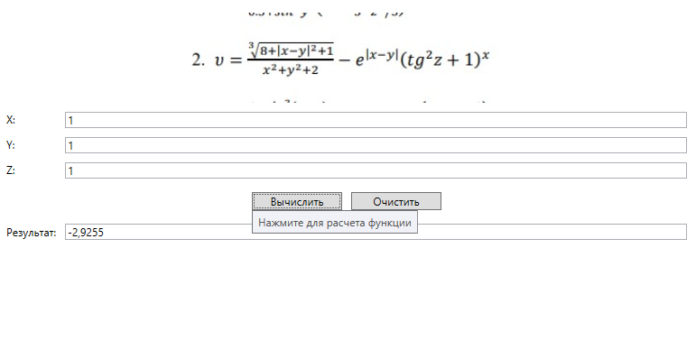
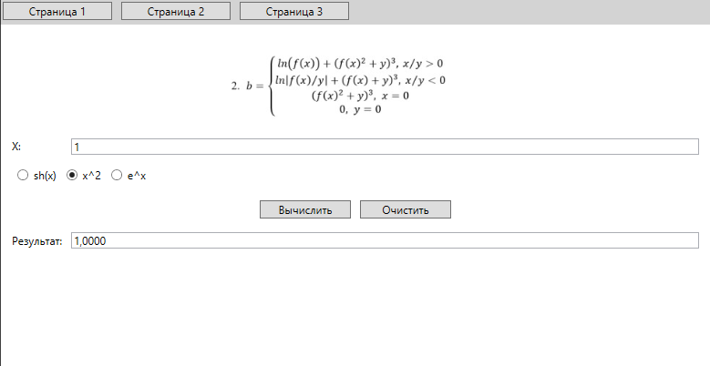
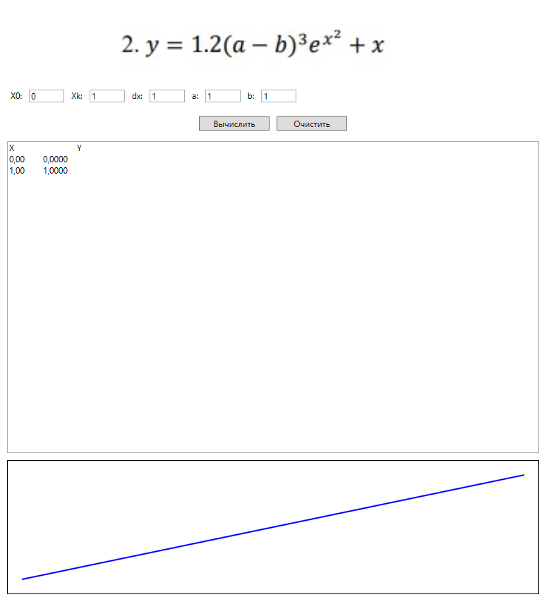
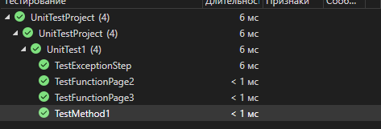

# Практическая4_Русаков_Худайбердин
# Практическая работа №4. Тестирование «белым ящиком» (Часть 1)

## Информация о работе

| Параметр | Значение |
|----------|----------|
| **Дисциплина** | Поддержка и тестирование программных модулей |
| **Название работы** | Практическая работа №4. Тестирование «белым ящиком» (Часть 1) |
| **Цель работы** | Приобрести практические навыки ручного тестирования методом «белого ящика» |
| **Выполнили** | Русаков А.С, Худайбердин М.Н |
| **Группа** | 3ИСИП-123|
| **Вариант задания** | №2 |

---

## Вариант задания: №2

### Страница 1 — Расчёт математической функции

**Формула:**

υ = √(8 + |x − y|² + 1) / (3x² + y² + 2) − e^|x−y| · (tg²z + 1) · x

**Элементы ввода:** X, Y, Z


---

### Страница 2 — Выбор функции

**Доступные функции:**
- sh(x) — гиперболический синус
- x² — квадрат числа
- e^x — экспонента

**Элементы ввода:** X, переключатели функций



---

### Страница 3 — Циклический расчёт и график

**Формула:**

y = 1.2 · (a − b)³ · e^(x²) + x

**Элементы ввода:** X0 (начало отрезка), Xk (конец отрезка), dx (шаг), a, b

**Вывод:** таблица значений X и Y, график функции



---

## Стек технологий

| Технология | Версия |
|------------|--------|
| Язык программирования | C# |
| Фреймворк | WPF (.NET 6.0 / .NET Framework 4.7.2) |
| Среда разработки | Visual Studio 2019/2022 |
| Система контроля версий | Git / GitVerse |
| Формат документации | Markdown (README.md) |

---

## Архитектура приложения

```
├── App.xaml                    # Точка входа приложения
├── App.xaml.cs
├── MainWindow.xaml             # Главное окно с навигацией
├── MainWindow.xaml.cs
├── Images/                     # Изображения для интерфейса приложения
│   ├── img1.jpg
│   ├── img2.jpg
│   └── img3.jpg
├── Pages/                      # Страницы приложения
│   ├── Page1.xaml              # Расчёт основной формулы варианта
│   ├── Page1.xaml.cs
│   ├── Page2.xaml              # Выбор функции (RadioButton)
│   ├── Page2.xaml.cs
│   ├── Page3.xaml              # Циклический расчёт и график
│   └── Page3.xaml.cs
├── docs/                      # Скриншоты приложения
│   ├── 1.png             
│   ├── 2.png
│   └── 3.png  
├── README.md                   # Данный файл
└── .gitignore
```

### Описание компонентов

| Компонент | Назначение |
|-----------|------------|
| **MainWindow** | Главное окно с кнопками навигации и Frame для переключения страниц |
| **Page1** | Расчёт формулы варианта с валидацией ввода |
| **Page2** | Выбор одной из трёх функций через RadioButton |
| **Page3** | Циклический расчёт значений, вывод таблицы и отрисовка графика на Canvas |
| **ValidateInputs** | Общий метод проверки заполненности и корректности полей ввода |
| **DrawChart** | Метод отрисовки графика на элементе Canvas |

---

## Функциональные требования (реализовано)

-  Навигация по трём страницам приложения
-  Элемент Image для отображения скриншота формулы на каждой странице
-  TextBox для ввода данных (X, Y, Z, a, b, X0, Xk, dx)
-  TextBox для вывода результатов (IsReadOnly = True)
-  Label для подписей элементов
-  Кнопки «Вычислить» и «Очистить» на каждой странице
-  RadioButton для выбора функции на странице 2
-  Canvas для отрисовки графика на странице 3
-  ToolTip для всех элементов интерфейса
-  Проверка полей ввода на заполненность и корректность данных

---

## Инструкция по запуску

1. Клонируйте репозиторий: https://github.com/svagatut123/Pr4_Rusakov_Khudayberdin.git

2. Откройте решение `Практическая4_Русаков_Худайбердин.sln` в Visual Studio 2019/2022

3. Восстановите NuGet-пакеты (при необходимости)

4. Запустите проект:
   - Нажмите **F5** для запуска с отладкой
   - Или **Ctrl + F5** для запуска без отладки

5. Введите значения в поля ввода и нажмите кнопку **«Вычислить»**

---

## Скриншоты интерфейса

### Главное окно (Страница 1)


### Страница 2


### Страница 3 с графиком


---

## Тестирование «белым ящиком»

### Покрытые пути выполнения

| Страница | Условия | Тестовые данные | Ожидаемый результат |
|----------|---------|-----------------|---------------------|
| Page1 | Все поля заполнены | X=1, Y=2, Z=0.5 | Корректный расчёт υ |
| Page1 | Пустое поле | X=пусто, Y=2, Z=0.5 | Сообщение об ошибке |
| Page1 | Неверный формат | X=abc, Y=2, Z=0.5 | Сообщение об ошибке |
| Page2 | Выбрана sh(x) | X=1 | Результат = sinh(1) |
| Page2 | Не выбрана функция | X=1 | Сообщение о выборе функции |
| Page3 | dx > 0 | X0=0, Xk=10, dx=1 | Таблица и график |
| Page3 | dx ≤ 0 | X0=0, Xk=10, dx=0 | Сообщение об ошибке |


## Примечания

1. Изображения формул в папке `Images/` используются в интерфейсе приложения (Build Action = Resource)
2. Изображения в папке `docs/` используются для документации в README.md
3. При изменении формул необходимо обновить скриншоты в обеих папках

## Практическая работа №6 (Часть 2). Автоматизированные тесты

### Выполненные действия
1. Создан проект модульного теста `UnitTestProject`.
2. Добавлена ссылка на основной проект `Практическая4_Русаков_Худайбердин`.
3. Проведен рефакторинг кода: формулы вынесены в класс `Functions.cs`.
4. Добавлены XML-комментарии для всех методов.
5. Написано 4 модульных теста (1 тренировочный + 3 для функций ПР4).

### Результаты тестирования
Все тесты выполнены успешно.

| Тест | Описание | Статус |
|------|----------|--------|
| TestMethod1 | Проверка формулы Страницы 1 | ✅ Пройден |
| TestFunctionPage2 | Проверка функции sh(x) | ✅ Пройден |
| TestFunctionPage3 | Проверка формулы Страницы 3 | ✅ Пройден |
| TestExceptionStep | Проверка исключения шага | ✅ Пройден |

### Скриншот Обозревателя тестов


### Вывод о проведенном тестировании
Тестирование прошло успешно.

**Причина успешного выполнения:**
- Логика вычислений вынесена в отдельный класс `Functions`.
- Использованы точные ожидаемые значения с погрешностью 0.0001.
- Обработка исключений проверена через блок try/catch (согласно методике Части 1).
- Код документирован с помощью XML-комментариев.

### XML-документация
Все публичные методы документированы с использованием тегов:
- `<summary>` — описание метода
- `<param>` — описание параметров
- `<returns>` — описание возвращаемого значения
- `<exception>` — описание возможных исключений
